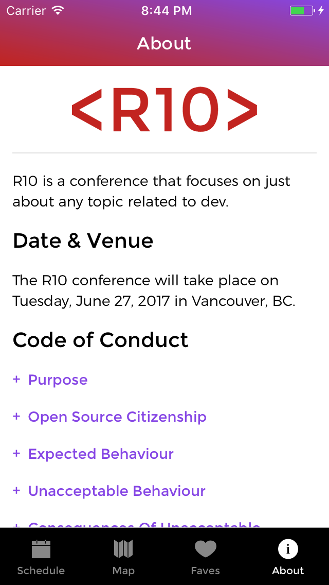
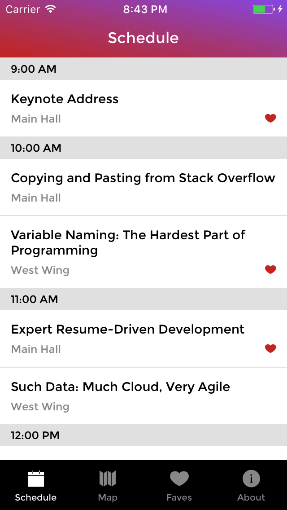
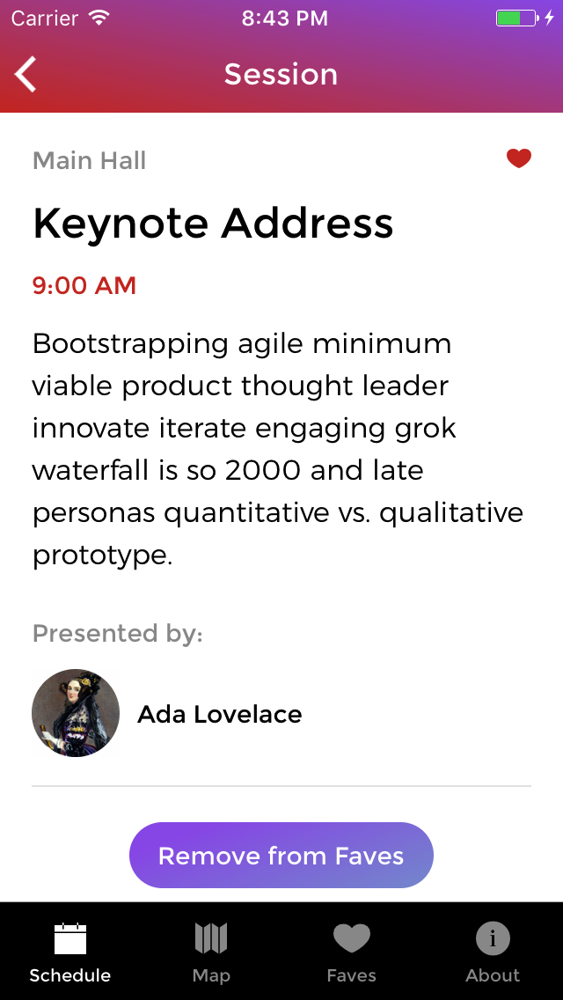
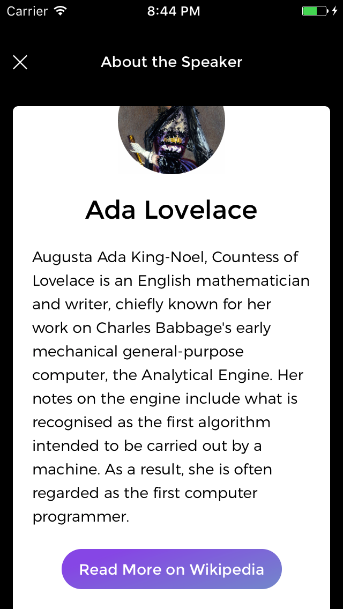

<h1> R10 - React Native</h1>
<h3>ASK:</h3> 

Use provided designs to build a cross-platform (iOS and Android) app for an upcoming conference. Through the app, users should be able to see details of the schedule, individual sessions, and speakers. Users should also be able to save individual sessions under a favourite tab for easy access.

<h3>FINISHED PRODUCT:</h3> 

React Native was used to build the app. All data was fetched through Firebase API endpoints. Redux is applied to manage state and Realm is used as a database to store ‘favourite’ sessions.

<table><tr><td>

</td></tr></table>
<table><tr><td>

</td></tr></table>

<table><tr><td>

</td></tr></table>
<table><tr><td>

</td></tr></table>

